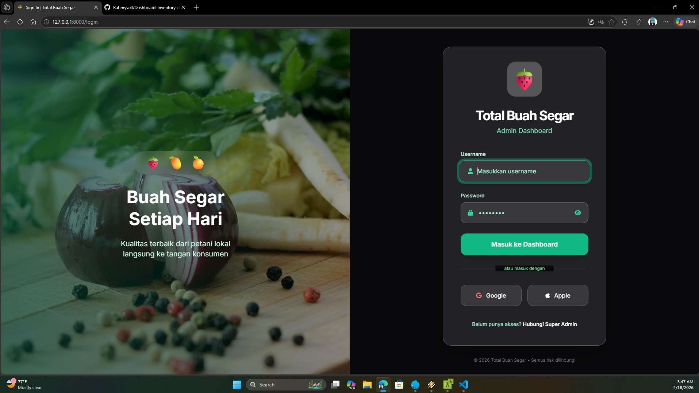

<p align="center">
  <a href="https://laravel.com" target="_blank">
    
  </a>
</p>

<h1 align="center">🍓 FreshHarvest Dashboard</h1>
<p align="center">
  <strong>Dashboard Real-time Total Buah Segar</strong><br>
  Pantau penjualan, stok, dan performa buah segar dengan tampilan yang indah dan responsif.
</p>

<p align="center">
  <a href="#fitur">Fitur</a> • 
  <a href="#demo">Demo</a> • 
  <a href="#instalasi">Instalasi</a> • 
  <a href="#screenshot">Screenshot</a>
</p>

---

## 🌟 Tentang Proyek

**FreshHarvest** adalah dashboard modern berbasis Laravel yang dirancang khusus untuk mengelola **total buah segar**.  
Dengan tampilan yang segar, warna-warni alami, dan data real-time, kamu bisa memantau penjualan harian, stok buah, tren penjualan, dan performa cabang dengan mudah dan menyenangkan.

Dibangun dengan **Laravel**, **Tailwind CSS**, **Livewire**, dan **Alpine.js** — cepat, ringan, dan siap produksi.

## ✨ Fitur Unggulan

- 📊 **Dashboard Utama** yang eye-catching dengan KPI cards buah segar
- 🍌 **Top Buah Terlaris** lengkap dengan gambar & ranking
- 📈 Grafik tren penjualan (7 hari / 30 hari)
- 🛒 Manajemen penjualan & stok buah real-time
- 📱 Tampilan **fully responsive** (mobile-friendly)
- 🎨 Desain modern dengan tema warna hijau-oranye segar
- 🔍 Filter cepat berdasarkan tanggal, cabang, dan jenis buah
- ⚡ Performa tinggi berkat Laravel & Livewire

## 📸 Screenshot

_(Tambahkan screenshot dashboard kamu di sini)_

<p align="center">
 <a><a>
</p>
<p align="center">
 <a><a>
</p>

## 🚀 Instalasi Cepat

```bash
git clone https://github.com/Rahmyvall/Dashboard-Inventory-dan-Penjualan-Total-Buah-Segar.git
cd freshharvest-dashboard

composer install
cp .env.example .env

php artisan key:generate
php artisan migrate --seed

php artisan serve
```
